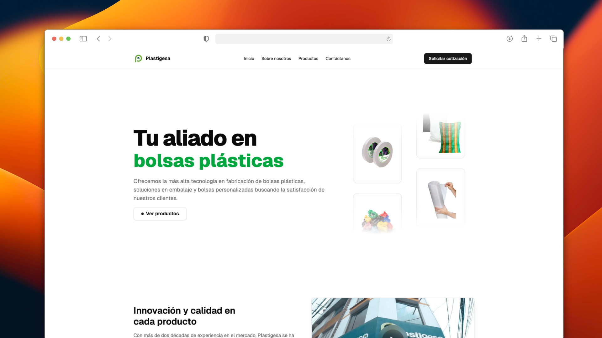

# Plastigesa EIRL - Sitio Web Corporativo

Este proyecto fue desarrollado para **Plastigesa EIRL**, una empresa peruana especializada en empaques flexibles y embalajes. El sitio web está construido con tecnologías modernas como **Next.js**, **TypeScript**, **Tailwind CSS**, **Strapi**, y **Framer Motion** para brindar una experiencia fluida, rápida y escalable.

Puedes visitar el sitio en [plastigesa.com](https://plastigesa.com/).

<div align="center">
<a href="https://plastigesa.com/">

</a>
<p></p>
</div>

<div align="center">

## 📚 Tecnologías Utilizadas


</div>

## 🚀 Características Principales

* Diseño atractivo, moderno y responsive
* Arquitectura Jamstack con consumo desde Strapi
* Animaciones con Framer Motion
* Carruseles interactivos con Swiper
* Despliegue automático con Vercel
* Integración con CMS headless para contenido dinámico
* Optimizado para SEO y performance

## 🏗 Estructura del Proyecto

```text
/
├── public/
│   └── favicon.svg
├── src/
│   ├── app/                 # Rutas App Router de Next.js
│   ├── components/          # Componentes reutilizables
│   ├── lib/                 # Funciones de utilidad (fetch, Strapi, etc.)
│   ├── styles/              # Estilos globales (Tailwind)
│   └── types/               # Tipado personalizado (Strapi, etc.)
├── next.config.js           # Configuración de Next.js
├── tailwind.config.ts       # Configuración de Tailwind
├── tsconfig.json            # Configuración de TypeScript
└── package.json             # Dependencias del proyecto
```

## 🦜 Comandos Principales

Desde la raíz del proyecto:

| Comando          | Acción                                               |
| ---------------- | ---------------------------------------------------- |
| `pnpm install`   | Instala todas las dependencias                       |
| `pnpm run dev`   | Inicia el servidor de desarrollo en `localhost:3000` |
| `pnpm run build` | Compila el sitio para producción                     |
| `pnpm run start` | Inicia el servidor en modo producción                |

## 🚧 Despliegue y Actualización Automática

Este proyecto está conectado con Strapi como CMS. Se utiliza un **webhook de Vercel** para desplegar automáticamente el sitio cada vez que se actualiza el contenido desde el panel de Strapi.